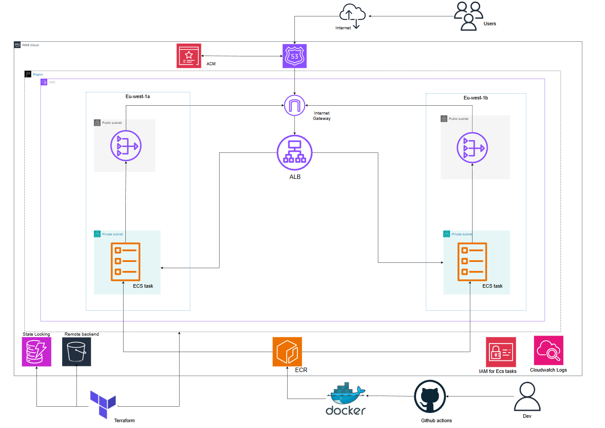

# ThreatComposer — ECS Fargate Deployment

Production deployment of ThreatComposer, an open-source threat modelling tool built by AWS, on AWS ECS Fargate using Docker, Terraform, and GitHub Actions.

**Live: https://tm.esproject.xyz**

Uploading "Loom _ Free Screen & Video Recording Software _ Loom - 27 March 2026.mp4

## Overview

This project deploys ThreatComposer on AWS with:

- **Containerisation** — Docker multi-stage build with non-root user and minimal image footprint
- **Infrastructure** — Terraform with modular architecture and remote state on S3
- **Orchestration** — ECS Fargate, serverless containers across two availability zones
- **Networking** — VPC with public and private subnets, ALB, security groups
- **TLS** — ACM certificate with DNS validation, HTTPS enforced via ALB listener rule
- **DNS** — Route53 alias record pointing to the ALB
- **Registry** — ECR with immutable tags and scan on push
- **CI/CD** — GitHub Actions with OIDC, no static credentials
- **Security scanning** — Trivy on Docker images, Checkov on Terraform code
- **Config management** — SSM Parameter Store for dynamic ECR URL retrieval
- **Logging** — CloudWatch with 7 day retention


<!-- Screenshot -->

---

## Architecture



---

## Repository Structure
```
├── app/                        
├── Dockerfile                  
├── .dockerignore
├── infra/
│   ├── main.tf                 
│   ├── variables.tf
│   ├── outputs.tf
│   ├── backend.tf              
│   └── modules/
│       ├── vpc/
│       ├── ecs/
│       ├── alb/
│       ├── ecr/
│       ├── acm/
│       └── route53/
└── .github/
    └── workflows/
        ├── docker.yml
        ├── plan.yml
        ├── apply.yml
        └── destroy.yml
```

---

## Bootstrap

The following must exist before running any pipeline. Create manually once — these are not managed by Terraform.

- **S3 bucket** — remote state storage with versioning enabled
- **DynamoDB table** — state locking with `LockID` as partition key
- **OIDC provider** — two IAM roles scoped to this repository, read role for plan and write role for docker, apply and destroy. Store role ARNs as GitHub secrets.

---

## Local Development
```bash
docker build -t threatcomposer ./app
docker run -p 8080:80 threatcomposer
curl http://localhost:8080/health

```

---

## CI/CD Pipelines

Four pipelines — infrastructure and application deployments are fully independent. All pipelines currently use `workflow_dispatch` for manual control.

| Pipeline | Steps |
|---|---|
| Docker | Build → Trivy scan → push to ECR |
| Plan | fmt → init → validate → Checkov → plan → upload artifact |
| Apply | Download plan → init → apply → health check |
| Destroy | init → destroy |

### Docker Pipeline
<!-- Screenshot -->

### Terraform Plan Pipeline
<!-- Screenshot -->

### Terraform Apply Pipeline
<!-- Screenshot -->

### Terraform Destroy Pipeline
<!-- Screenshot -->

---

## Intended Pipeline Triggers

When moved to a team environment, pipelines would be triggered as follows rather than manually:

| Pipeline | Trigger | Path Filter |
|---|---|---|
| Docker | Push to `main` | `app/**`, `Dockerfile` |
| Plan | Pull request | `infra/**` |
| Apply | Merge to `main` | `infra/**` |
| Destroy | `workflow_dispatch` only | — |

Path filters ensure only the relevant pipeline fires when changes are made. A change to `app/` never triggers a Terraform plan. A change to `infra/` never triggers a Docker build. Destroy remains manual only — never automated under any circumstance.

---

## Security

| Control | Implementation |
|---|---|
| No static credentials | OIDC — credentials issued per job, expire on completion |
| Least privilege | Separate read and write IAM roles — plan cannot modify infrastructure |
| Network isolation | ECS tasks in private subnets, ECS SG scoped to ALB SG only |
| TLS | ACM certificate, HTTP redirects to HTTPS via ALB listener rule |
| Image integrity | Immutable ECR tags — SHA tags permanently locked on push |
| Vulnerability scanning | Trivy on every image build — fails on fixable critical CVEs |
| IaC scanning | Checkov on every PR — catches misconfigurations before deployment |
| Config management | SSM Parameter Store — no hardcoded values in pipelines or code |

---

## Future Improvements

**WAF** — attach AWS Web Application Firewall to the ALB for rate limiting, SQL injection protection, and geo-blocking.

**Secrets Manager** — migrate sensitive values from SSM Parameter Store to AWS Secrets Manager for automatic secret rotation.

**Multi-environment** — separate dev and prod Terraform workspaces with environment-specific tfvars. Currently single environment only.

**Monitoring** — CloudWatch alarms on ALB 5xx error rate and ECS task health. Currently logging only with no alerting.

---

## Teardown

Trigger the destroy pipeline manually from GitHub Actions. S3 bucket and DynamoDB table are Tier-0 and not Terraform managed — delete manually if no longer needed.
